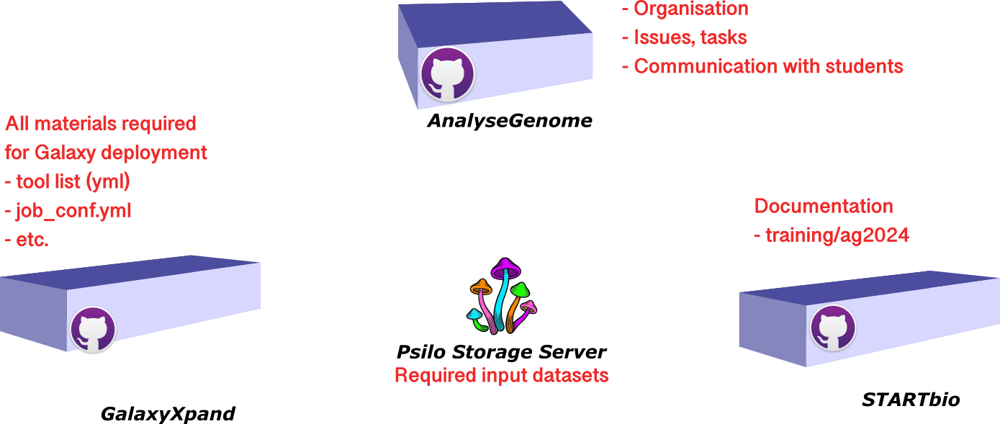

# Analyse des Génomes

Ce repository GitHub est le successeur de https://github.com/ARTbio/Run-Galaxy.

Il est utilisé pour collecter le matériel spécifique du training Galaxy du cours d'Analyse des Génomes
2024.

Il contient désormais assez peu de code utile car le déploiement de Galaxy pour le
cours est codé avec [galaxyXpand](https://github.com/ARTbio/galaxyXpand/blob/ag2024/scripts/deploy_ag2024.sh).

Néanmoins il reste un bon "Hub" pratique pour la communication des problèmes ou
avec les étudiants.

Le repository `AnalyseGenome` est apparié à une documentation révisée pour 2024,
dans la branche `ag2024` de [startbio](https://artbio.github.io/startbio) :

